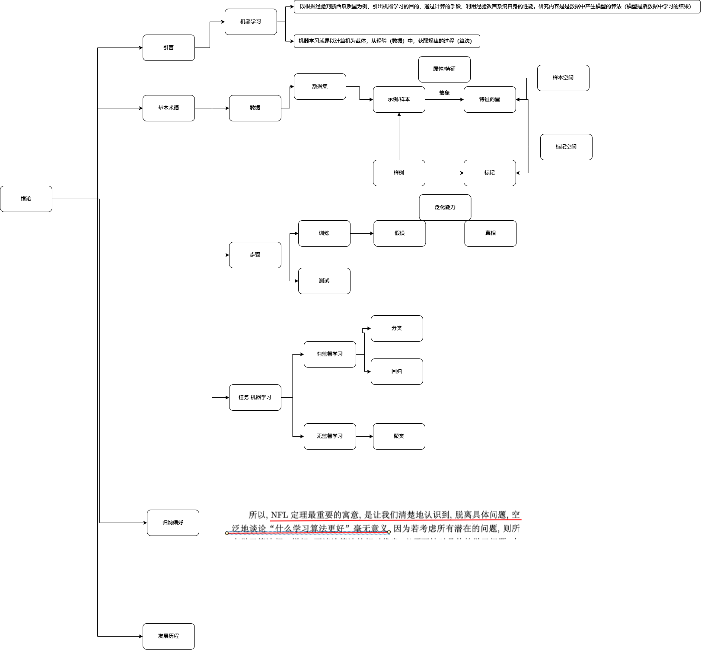
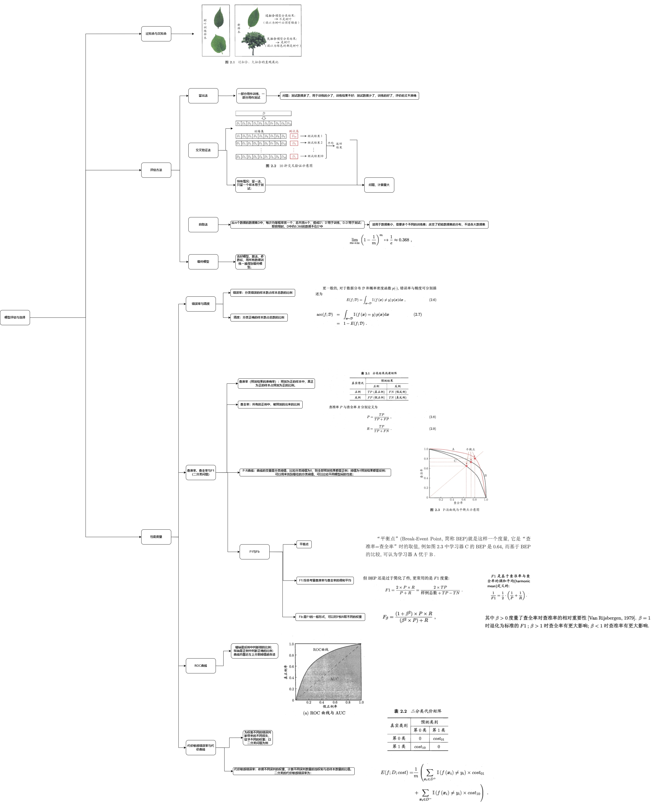

## 介绍
datawhale九月份学习任务-吃瓜教程；
##  1绪论
### 小结
本节用买瓜的例子，讲述了机器学习的概念，介绍了众多基本术语，推导了一个道理，算法是面向具体任务的，脱离任务算法好坏无从谈起，最后介绍了机器学习的历史。
### 笔记

## 2模型评估与选择
### 小结
本节介绍了过拟合和欠拟合的概念，接着介绍了三种训练方法，各有优劣势，接着，介绍了多种性能度量的指标，用于度量在测试集中的性能，最后，比较了测试集中的误差与泛化误差。
### 笔记

