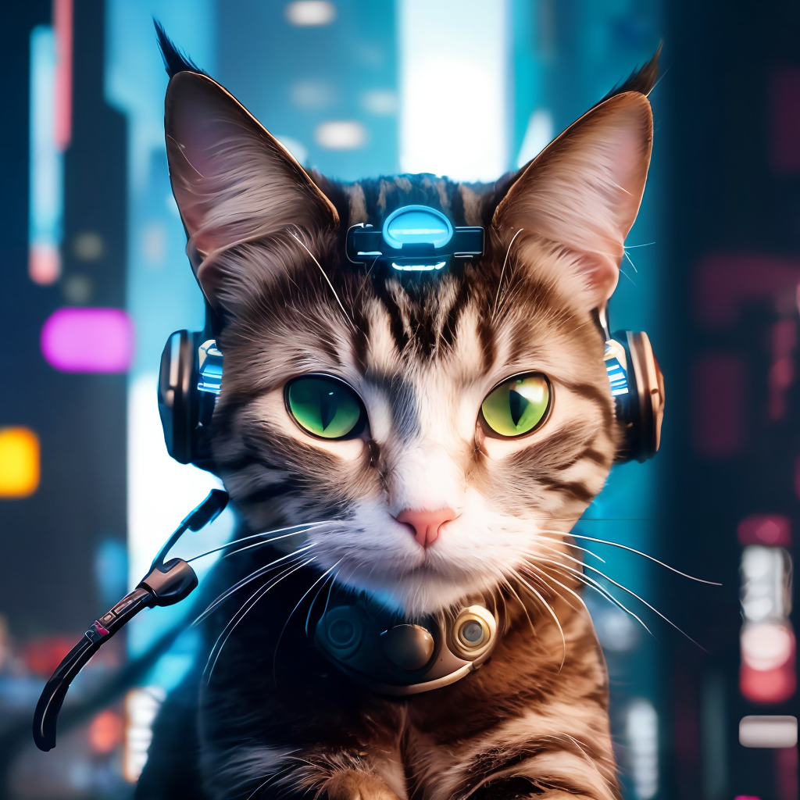

## 第一课 介绍
### 主要对象
模型：常用U-Net模型，输入带噪声的图像及时间步长，输出图像中的噪声；  
调度器：训练时，模型预测前，以一定比例向图像中添加噪声，作为模型预测的输入；推理时，模型预测后，控制从有噪声的图像中减去噪声；  
noise = torch.rand_like(x)  
noisy_x = (1-amount)*x + amount*noise  
DDPM的权重变化，橙色线为amount：  
  
损失函数的目标：最小化预测噪声和噪声之间的误差  
时间步长：一次性预测去除全部噪声效果不如一步步去除噪声
### 训练
训练一个U-Net模型，输入图像、随机噪声及随机时间步长；  
调度器根据时间步长，控制向图像中添加噪声；  
损失函数计算噪声与预测噪声之间的误差；  
最终，模型具备从带噪声的图像中，分离出噪声的能力。  
### 推理
生成随机噪声，作为初始图像，初始时间步长为1；  
U-Net模型分离出噪声；  
调度器根据初始图像和噪声及时间步长，生成去噪后的图像；  
回到第二步。
### 模型输入输出
保存模型  
image_pipe.save_pretrained("my_pipeline")  
读取模型  
butterfly_pipeline = DDPMPipeline.from_pretrained("my_pipeline").to(device)  

## 赛博猫咪

