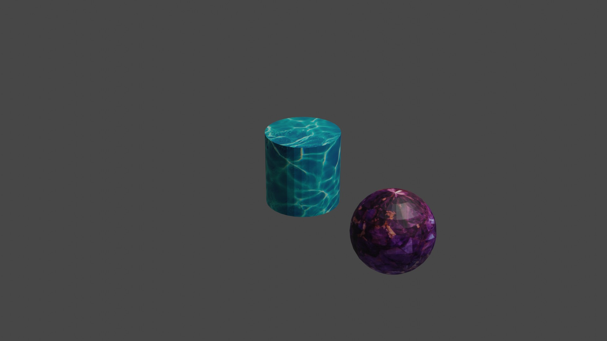

## 介绍
之前了解过Blender软件，是一款功能强大且开源的软件，但没有仔细学习过，希望借助chatgpt等模型来帮助学习。
##  实践过程
本次实践中，尝试让chatgpt帮助我绘制一个球体绕圆柱旋转的小动画，创建三维模型和动画chatgpt完成的不错，但在最后绘制纹理时，始终无法给出满意的答案；使用newbing来尝试解决问题时，newbing给出了一些Blender官方的参考资源，但没能分析出问题并解决问题；最后通过参考官方Blender手册解决了问题。
## 动画截图

## 动画
<video controls>
  <source src="https://gitee.com/Tzian/datawhale_task_5month/blob/master/00.mp4" type="video/mp4">
</video>

## 总结
整体上，感觉大模型们表现的很好，尤其是在常识性，通用性的知识方面，对于新接触的领域或事物，大模型们能帮助我们快速的上手；但在细致深入的问题上，大模型们的帮助较少，有时甚至会误导我们。
## 对话内容
https://chat.openai.com/share/ccb3db16-f121-4003-a8f9-6a25efe81d01