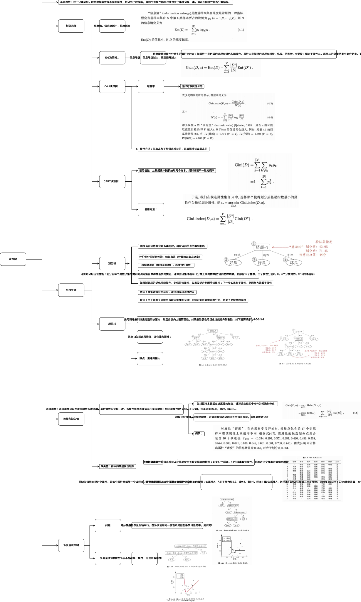

## 介绍
datawhale九月份学习任务-吃瓜教程；
##  1绪论
### 小结
本节用买瓜的例子，讲述了机器学习的概念，介绍了众多基本术语，推导了一个道理，算法是面向具体任务的，脱离任务算法好坏无从谈起，最后介绍了机器学习的历史。
### 笔记

## 2模型评估与选择
### 小结
本节介绍了过拟合和欠拟合的概念，接着介绍了三种训练方法，各有优劣势，接着，介绍了多种性能度量的指标，用于度量在测试集中的性能，最后，比较了测试集中的误差与泛化误差。
### 笔记

## 3线性模型
### 小结
本节介绍线性模型的概念，在回归任务、分类任务中如何学习线性模型，还学习了用线性判别分析的进行分类学习的方法，最后介绍了如何用二分类分类器解决多分类问题，及分类数据不均衡时的常见应对方法。另外，本节涉及了最大似然估计和协方差矩阵的概念，需要了解或掌握。
### 笔记

## 4决策树
### 小结
本节介绍决策树的概念，重点介绍划分准则，即如何选择划分属性，介绍使用不同剪枝的方法及优缺点，提高模型的泛化能力，对于连续属性和缺失属性需要特殊处理，处理思路与离散非缺失样本思路一致，最后介绍了多变量决策树，使用连续变量的线性组合作为属性，而不是单一的属性，提高对复杂问题的处理效率。
### 笔记

