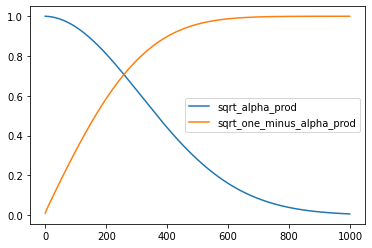
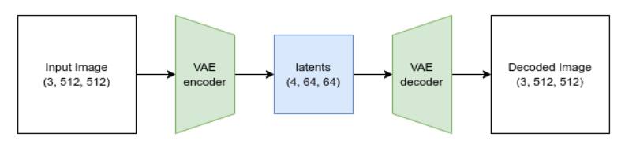
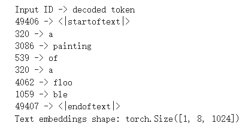
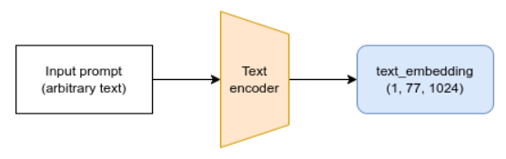
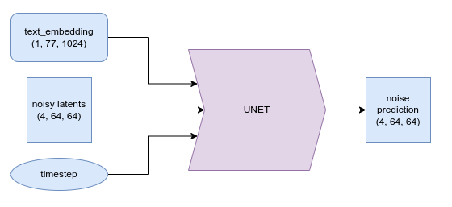
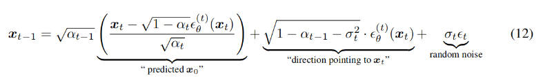
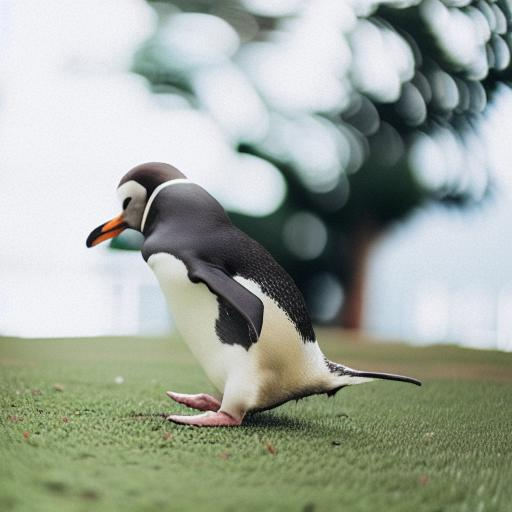

## 第一课 介绍
### 主要对象
模型：常用U-Net模型，输入带噪声的图像及时间步长，输出图像中的噪声；  
调度器：训练时，模型预测前，以一定比例向图像中添加噪声，作为模型预测的输入；推理时，模型预测后，控制从有噪声的图像中减去噪声；  
noise = torch.rand_like(x)  
noisy_x = (1-amount)*x + amount*noise  
DDPM的权重变化，橙色线为amount：  
  
损失函数的目标：最小化预测噪声和噪声之间的误差  
时间步长：一次性预测去除全部噪声效果不如一步步去除噪声
### 训练
训练一个U-Net模型，输入图像、随机噪声及随机时间步长；  
调度器根据时间步长，控制向图像中添加噪声；  
损失函数计算噪声与预测噪声之间的误差；  
最终，模型具备从带噪声的图像中，分离出噪声的能力。  
### 推理
生成随机噪声，作为初始图像，初始时间步长为1；  
U-Net模型分离出噪声；  
调度器根据初始图像和噪声及时间步长，生成去噪后的图像；  
回到第二步。
### 模型输入输出
保存模型  
image_pipe.save_pretrained("my_pipeline")  
读取模型  
butterfly_pipeline = DDPMPipeline.from_pretrained("my_pipeline").to(device)  

## 赛博猫咪

## 第二课 
### 加速采样过程
更换DDPM调度器为DDIM，DDIM迭代次数更少，每次步进1000/n步而不是1步
### 微调模型
使用新的数据重新训练unet网络
### 引导
#### 损失函数与梯度
重新定义损失函数，将去噪图像与期望图像的误差作为损失函数，每次迭代生成图像时，计算损失函数的关于输入噪声图像的梯度，用梯度更新去噪图像；
介绍了两种方法，一种是不计算预测噪声的梯度，显存占用少，但精度低；另一种是计算预测噪声的梯度，显存占用多，精度高；后一种精度高的原因是计算的梯度更加准确，但计算量也大。
#### CLIP
与前一种思路相同，只不过损失函数不同，利用CLIP模型将去噪图像编码为嵌入特征1，利用CLIP模型将输入文本转为token，然后用CLIP将token转为嵌入特征2，计算嵌入特征1与2之间的误差即为损失函数，后面与之前相似，计算梯度，更新去噪图像，用这样的方法让生成的图像接近于输入文本对应的图像。
### 类条件模型例子
使用mnist数据集训练unet模型，与常规不同的是，unet模型做了修改，增加了一个条件控制输入，可以输入0-9的数字，该数字会被映射成一个多维向量，然后将该多维向量复制成与输入图像同等大小，增在到输入图像的后面几个通道，与输入图像多维向量一起构成unet模型输入。
这个条件控制输入数字是如何控制模型生成对应数字的图像？
训练时，2的图像与控制输入数字2都参与到训练中，2的图像+随机噪声+输入数字2输入到模型中，模型预测噪声后，预测噪声与随机噪声做误差计算；只有输入数字是2时，会产生2图像对应的噪声，推理时，从带噪图像中预测2图像对应的噪声，一次次从带噪图像中分离2图像对应的噪声，最终就会得到2的图像。

## 老虎人

## 第三课 
stable diffusion是一个文生图潜在扩散模型，主要由VAE、Tokenizer、文本编码器、Unet、调度器组成。
### VAE(Variational Auto-Encoder)
由于注意力的使用，使得计算量随图像尺寸的增加，平方的增长，尺寸扩大一倍，计算量增加四倍，因此，引用VAE用将图像表示为更小的潜在表示，降低运算量。

### Tokenizer(词法分析器)
将单词转为数字，如下将‘A painting of a flooble’转为带始末标志的8个数字

### Text Encoder（文本编码器）
将token转为编码块  
  
### Unet
输入文本编码、带噪声图像的潜在空间表示、迭代次数，输出噪声图像的潜在空间表示  

### Scheduler(调度器)
训练时，模型预测前，以一定比例向图像中添加噪声，作为模型预测的输入；推理时，模型预测后，控制从有噪声的图像中减去噪声；
noise = torch.rand_like(x)  
noisy_x = (1-amount)*x + amount*noise 

## 春夏秋冬

## 第四课 
### DDIM
DDIM调度器的公式如下，本节的采样过程与之前的相同，由提示词和初始随机噪声的隐式图像生成提示表达的清晰图像。

### DDIM反转
反转与正常采样的过程相反，由清晰图像和提示词，回退出开始的随机噪声图像，具体DDIM反转的操作方式是将a_t与a_t-1调换，令上式中的a_t=a_t-1，a_t-1=a_t；  
#### 反转有什么作用？  
不仅可以获得初始状态的噪声图像，还可以获得初始噪声到最终清晰图像的任何一个隐式表达，可以用来生成与清晰图像相似的图像，用该隐式表达为初始隐式图像，跟换提示词，生成与原图相似的新图像，越接近清晰图像的隐式表达，生成的图像与清晰图像越相似。
#### 用反转+采样生图和图生图有什么区别？
反转加采样和图生图都是改变了初始的隐式图像，用带有部分特征的隐式图像生成新的图像，使得新的图像带有初始图像的一些特征。  
但二者生成隐式图像的方式不同，图生图用VAE有图像直接生成隐式图像；而反转则是用图像和提示词为输入，由Unet和调度器一步步还原成隐式图像，可以提供不同步骤的隐式图像，由于提示词的使用，与图像越接近的提示词，越方便采样时准确的修改图像，与图像越不相关的提示词，越不利于图像的修改。

